<div align="center">



<br/><br/>

<a href="https://github.com/Jhojan98">
  
</a>

<br/>


<br/><br/>

<a href="https://github.com/Jhojan98"></a>
<a href="https://www.linkedin.com/in/jhojan-aragon-58801029a/"></a>
<a href="mailto:jharagonr@gmail.com"></a>

<br/>


</div>

> *"Passionate about building solutions that contribute to a better future."*

---

## `>` Who I am

I'm **Jhojan Aragón**, a **Systems Engineering student** (*Ingeniería de Sistemas*) at **Universidad Distrital Francisco José de Caldas**, in Bogotá D.C., Colombia 🇨🇴 — currently in my **8th semester**.

I focus on the part of software that has to survive contact with reality: **backend services and cloud architecture**. I like designing systems thinking about deployment, scaling and maintenance — not just the demo. I also enjoy what surrounds the code: gathering requirements with real stakeholders, modeling data, containerizing services and automating delivery. My university projects have been my main training ground, and the ones I'm proudest of were built for **real clients**.

```yaml
jhojan:
  role:     Backend & cloud-focused developer
  study:    Ingeniería de Sistemas @ Universidad Distrital F.J.C. (8th semester)
  based:    Bogotá D.C., Colombia
  building: backend services · cloud-ready architectures · AI pipelines
  learning: Docker · Flask · Django · DevOps
  mindset:  "design for deployment, not just for the demo"
```

---

## `>` Focus areas

-  **Backend engineering** - REST APIs with FastAPI, Django and Spring Boot; authentication, data modeling, microservices
- **Cloud & DevOps** - Docker, containerized services and CI with GitHub Actions; designing for deploy and operations from day one
- **AI & data** - machine-learning pipelines with scikit-learn and pandas (SECOP II corruption-risk model: Random Forest AUC-ROC ≈ 0.84 vs. 0.71 for logistic regression)
- **Full-stack** - React and Vue frontends when the product needs one

---

## `>` Featured

| Project | What it is | Stack |
|---|---|---|
| **Autocarga Pro** — Terra Towing Dispatch | Towing-fleet dispatch platform built with a **real client**: fleet, drivers, clients and point-A-to-point-B dispatching with role-based access; requirements gathered through direct stakeholder meetings | `React · FastAPI · Docker` |
| **[UrbanRide](https://github.com/Jhojan98/UrbanRideProject)** | Bicycle-rental web app in Pereira: admin management, reports, email services and real-time station tracking over MQTT | `Vue · Spring Boot · FastAPI · MQTT` |
| **[ResurgeAgent](https://github.com/Jhojan98/ResurgeAgent)** | Multi-agent system for emergency and disaster response: turns scattered citizen reports into structured coordination of people, supplies and routes | `JavaScript · Multi-agent` |
| **[SECOP II](https://github.com/Jhojan98/SecopII)** | Machine-learning pipeline over Colombian public-procurement data (SECOP II): extraction, feature engineering and model comparison to prioritize corruption-risk audits | `Python · scikit-learn · pandas` |
| **[Ecoladrillos](https://github.com/Jhojan98/Ecoladrillos)** | Inventory and construction-process management for an eco-brick manufacturing company, built end to end with an MVC architecture | `Django · React` |

<sub>↓ More in my repos — [api-rest-libros](https://github.com/Jhojan98/api-rest-libros) (REST API exercise), [Proyecto-Habitabilidad](https://github.com/Jhojan98/Proyecto-Habitabilidad) (habitability analysis, Python), [AnteProyectoMetodologia](https://github.com/Jhojan98/AnteProyectoMetodologia) and [PaperAutonomusCarRace](https://github.com/Jhojan98/PaperAutonomusCarRace) (research papers in LaTeX).</sub>

---

## `>` Tech stack

**Languages**
<br/>


**Frameworks & Runtime**
<br/>


**Data & Tools**
<br/>


---

## `>` Education

| Institution | Program |
|---|---|
| **Universidad Distrital Francisco José de Caldas** — Bogotá D.C., Colombia | Ingeniería de Sistemas *(Systems Engineering)* |

---

## `>` GitHub

<div align="center">


<br/><br/>


</div>

---

<div align="center">

**Let's build something** — [LinkedIn](https://www.linkedin.com/in/jhojan-aragon-58801029a/) · **jharagonr@gmail.com**


</div>
